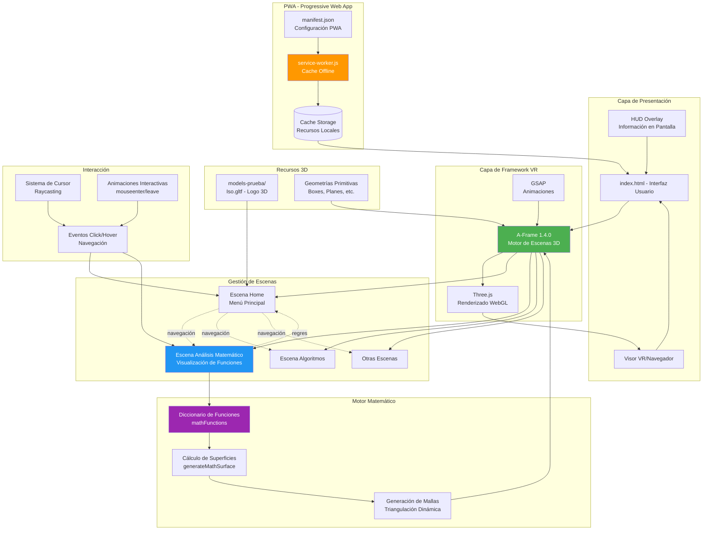
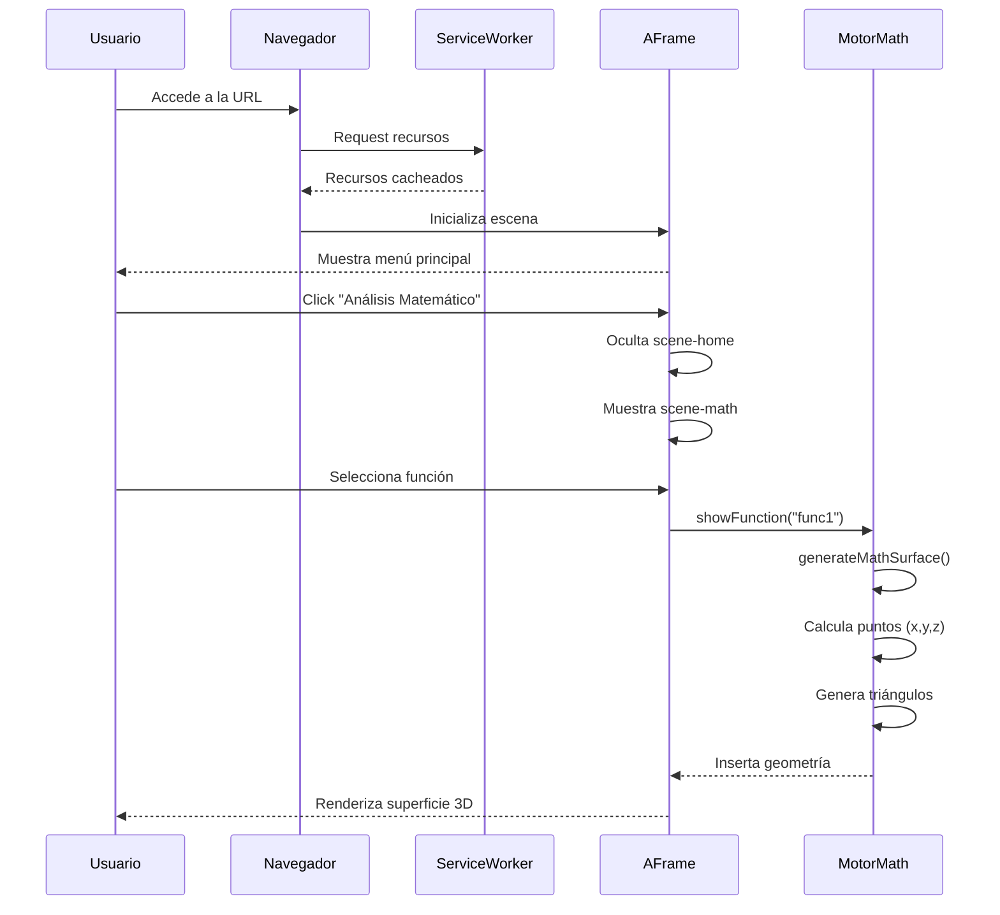

# Arquitectura Conceptual - Entorno Virtual Interactivo RAIA

## Resumen Ejecutivo

RAIA es una Progressive Web App (PWA) inmersiva desarrollada con A-Frame 1.4.0 y Three.js que proporciona un entorno virtual 3D completamente interactivo para la visualización dinámica y en tiempo real de conceptos educativos complejos. La arquitectura implementa un sistema modular de escenas que permite a los usuarios navegar entre diferentes módulos educativos (Análisis Matemático, Algoritmos de Ordenamiento y extensiones futuras) mediante menús 3D interactivos con feedback visual.

En el módulo **Análisis Matemático**, cada visualización se genera de forma dinámica mediante triangulación automática de superficies multivariable, aplicando colorización basada en altura para una mejor comprensión espacial. Los usuarios pueden explorar funciones trigonométricas, polinómicas y exponenciales (sin(x)·cos(y), x²+y², e^(-(x²+y²)), etc.) renderizadas como geometrías 3D con ejes coordenados y etiquetado interactivo.

En el módulo **Algoritmos de Ordenamiento**, se visualizan algoritmos clásicos (Bubble Sort, Insertion Sort, Quick Sort) mediante barras animadas en 3D que representan elementos del array. El sistema codifica con colores los eventos de comparación y movimiento, permitiendo seguir paso a paso la lógica del algoritmo con control de reproducción y reinicio.

La aplicación es completamente accesible desde navegadores web convencionales, dispositivos móviles y headsets de realidad virtual, gracias al sistema de raycasting y renderizado estereoscópico de A-Frame. El componente PWA garantiza funcionamiento offline integral mediante un Service Worker que cachea de forma inteligente todos los recursos estáticos (HTML, CSS, JavaScript, modelos 3D .gltf y dependencias externas), permitiendo instalación como aplicación nativa con persistencia total. La arquitectura está diseñada para ser altamente escalable: agregar nuevas funciones matemáticas, algoritmos o escenas requiere únicamente modificaciones mínimas al archivo principal.

## Diagrama de Arquitectura



## Componentes Principales

### 1. **Frontend (index.html)**

- **Tipo**: Single Page Application (SPA)
- **Framework**: A-Frame 1.4.0 sobre Three.js
- **Características**:
  - Escenas múltiples con navegación
  - Sistema de menús interactivos 3D
  - HUD para información contextual
  - Animaciones GSAP para transiciones

### 2. **Motor de Realidad Virtual**

- **A-Frame**: Sistema de entidades-componentes para WebVR
- **Three.js**: Renderizado WebGL bajo nivel
- **Capacidades**:
  - Renderizado estereoscópico para VR
  - Soporte para dispositivos móviles y headsets
  - Raycasting para interacción con objetos

### 3. **Sistema de Visualización Matemática**

- **Motor de Funciones**:
  ```javascript
  mathFunctions = {
    func1: {
      formula: (x, z) => Math.sin(x) * Math.cos(z),
      name: "sin(x) * cos(y)",
      description: "...",
      domain: "...",
    },
  };
  ```
- **Generación Dinámica**:
  - Triangulación de superficies en tiempo real
  - Colorización basada en altura (gradiente)
  - Resolución configurable de malla
  - Sistema de coordenadas 3D con ejes

### 4. **Progressive Web App (PWA)**

- **Manifest**: Configuración de instalación
- **Service Worker**:
  - Cache de recursos estáticos
  - Funcionamiento offline
  - Estrategia cache-first
- **Recursos cacheados**:
  - HTML, CSS, JavaScript
  - Modelos 3D (.gltf)
  - Dependencias externas (A-Frame)

### 5. **Sistema de Interacción**

- **Cursor Virtual**: Raycasting para selección
- **Eventos**:
  - Click para navegación
  - Hover para efectos visuales
  - Animaciones de feedback
- **Navegación**:
  - Menú principal → Subescenas
  - Botones de retorno
  - Transiciones suaves

### 6. **Recursos 3D**

- **Modelos GLTF**: Logo animado (Iso.gltf)
- **Primitivas A-Frame**:
  - Boxes para botones
  - Planes para piso
  - Triangles para superficies matemáticas
  - Text para etiquetas

## Flujo de Datos



## Tecnologías Utilizadas

| Componente   | Tecnología        | Versión       | Propósito                   |
| ------------ | ----------------- | ------------- | --------------------------- |
| Framework VR | A-Frame           | 1.4.0         | Desarrollo de escenas WebVR |
| Motor 3D     | Three.js          | (vía A-Frame) | Renderizado WebGL           |
| Animaciones  | GSAP              | 3.12.2        | Transiciones suaves         |
| PWA          | Service Worker    | ES6+          | Funcionamiento offline      |
| Modelos 3D   | GLTF              | 2.0           | Assets 3D optimizados       |
| Servidor     | http-server/serve | -             | Desarrollo local            |

## Características de la Arquitectura

### ✅ Ventajas

- **Modular**: Escenas independientes fácilmente extensibles
- **Offline-first**: PWA con cache completo
- **Cross-platform**: Funciona en navegador, móvil y VR headsets
- **Performante**: Renderizado WebGL optimizado
- **Educativo**: Visualización matemática interactiva

### 🔄 Escalabilidad

- **Agregar funciones**: Solo modificar `mathFunctions`
- **Nuevas escenas**: Duplicar estructura de escena existente
- **Modelos 3D**: Añadir archivos .gltf a carpeta models-prueba
- **Interacciones**: Sistema de eventos extensible

### 🎯 Casos de Uso

1. **Educación Matemática**: Visualización de funciones multivariable
2. **Demostración VR**: Prototipo de entorno virtual inmersivo
3. **PWA**: Aplicación instalable que funciona offline
4. **Navegación 3D**: Sistema de menús y escenas interactivas

## Estructura de Archivos

```
helloworld-vr-raia/
├── index.html              # Aplicación principal (1423 líneas)
├── manifest.json           # Configuración PWA
├── service-worker.js       # Cache y offline
├── README.md               # Documentación
├── models-prueba/
│   └── Iso.gltf           # Logo 3D animado
└── arquitectura-conceptual.md  # Este documento
```

---

**Fecha**: Enero 2026  
**Proyecto**: Entorno Virtual Interactivo RAIA  
**Versión**: 1.0
